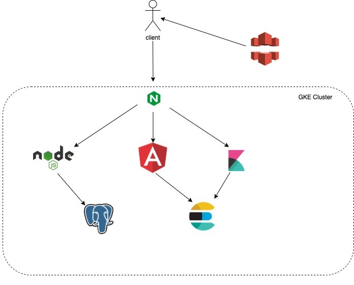

# Project Proposal

### Project Title:
Mint-Cards

### Team Members:
* Abel Debalkew
* Brent Rim
* Lintao Yin

### URLS:
* Application: https://mintcard.me/
* Backend Readme: https://github.com/UTSCC09/project-mint/tree/master/backend
* Video Demonstration: https://youtu.be/1gxjk7TLOi4

### Description of the Web Application: 
A utility designed to help put together cards in order to make a deck in the Trading Card Game, Magic the Gathering. The applications' main purpose is to provide a clean interface in which users can build a deck. To support the user the web app will provide tools for searching for cards and data visualization to better understand the makeup of the deck to support the user. Our goal is to provide a smarter, cleaner tool than what is currently available.

### Description of the key features that will be completed by the Beta version: 
* Allowing users to create accounts, login, and logout securely.
* Allowing users to create, edit, and save multiple decks.
* A UI that lets users view and edit decks.
* Ability to search for individual cards by name, or properties, to create decks.

### Description of additional features that will be complete by the Final version:
* Data visualization for the decks to allow users to better understand the properties of the decks / cards.
* Search tool for cards that can match similair key words and phrases to cards.
* Exporting decks to a file.
* Profile page for each user for analytics.
* Screen to browse other decks.

### Description of key features that are in the Final version:
* Login, logout, and registration of users handled by the client and backend
* Users can create view and edit multiple decks
* Users can search the database for cards using different characteristics of cards
* Users can search using elasticsearch to get a more natural list of cards from the database
* Users can visualize their current deck in order to get kibana graphs and visualization about their decks and gather a better understanding of the cards in their deck
* Screen beside screen editing so users can see the list of cards from their search and add it in to their deck. They can also resize the scale of each half of the screen

### Description of the technology that you will use:
* Angular2 will be our main front-end framework. It will provide an easier way to produce screens and has plenty of additions to make front-end development easier.
* Material Design will provide most of our styling. It has a large suite of useful UI components that are simple to implement reducing UI development time.
* ngrx/store, ngrx/effects, ngrx/entity are a series of libraries that help encapsulate the front end from the back as well as help reduce resource wastage.
* ExpressJS: Express is a NodeJS framework used for building web applications. We chose this for our backend because it is light, efficient, and we are using it in class.
* MTGJSON: An open source project that catalogs all Magic: The Gathering cards. Stores information about card properties and prices combined into JSON files.
* REST API endpoints: provide a simple interface to allow connections with the server from the app or other services.
* In House Authentication closely following what we've learned in lecture.
* Kibana: A data visualization tool that allows us to display various statistics of MTG cards and decks. Works with our elastic search api to represent the data in a clean pairing.
* Elastic Search: A search and analytics engine that incorporates natural language processing which we will use to assist building our deck by identifying relevant cards.
* angular-split: to help provide a draggable gutter that separates two windows of the application. 
* There are additional tools for deploying the web application, but we were going to discuss our options after our lecture on deploying web apps. 

### Description of the top 5 technical challenges (not in any order):
* Getting familiar with angular and learning the best practices. (Abel and Brent)
* Frontend UI, displaying cards, and the deck layout.
* deploying a web app to a static domain.
* Integrating machine learning with little prior exprience.
* Using data visualization to show properties of cards and decks.

### How to build the app locally
* install elasticsearch https://www.elastic.co/downloads/elasticsearch
* install kibana https://www.elastic.co/downloads/kibana
* install postgresql https://www.postgresql.org/download/
* Spin up postgresql and run Schema.sql and backendUser.sql
* Run the following scripts to make tables: cardDb.sql, imageTableDump.sql, UsersTable.sql, DecksTable.sql
* Spin up elasticsearch by moving to it's install location then bin and running .\elasticsearch
* Run elastic.py to load the cards into elastic search
* Spin up kibana by moving to it's install location then bin and running .\kibana.bat
* start the backend by going into the backend folder and running node ./main.js
* start the frontend server by going into the frontend/mint folder and running ng serve
* application should now be started

### Deployments
We deployed our web application to a GKE cluster. Steps we would take to do are to:
* Build our local docker images (usualy just node and anuglar).
* Upload them to a repo.
* We could then use our yaml files to build the other services and deployments and launch everything to the GKE.
We exposed one service, our ingress, externally and mapped the our domain to its ip address. We handled ssl certifications using letsencrypt and cert-manager. Lastly, we also have a CloudFront CDN that we use to store the images for all our card data. The diagram below illustrates our basic architecture.

### NOTES:
The Kibana service can be accessed using https://mintcard.me/app/kibana#/. This does not pose a security risk as Visualizations are meant to be dynamically generated and the user cannot interact with elasticsearch indexes. Since Users create kibana saved objects via the backend by request a simple refresh of the page will restore any objects that are being used by kibana. 